<<<<<<< HEAD
# SmartSentry: Advanced Security Surveillance System


## Overview

SmartSentry is an intelligent security surveillance system that combines state-of-the-art computer vision and language models to provide comprehensive security monitoring. The system integrates YOLOv8 for real-time object detection and LLaVA for advanced scene understanding.

## System Architecture

### High-Level Architecture
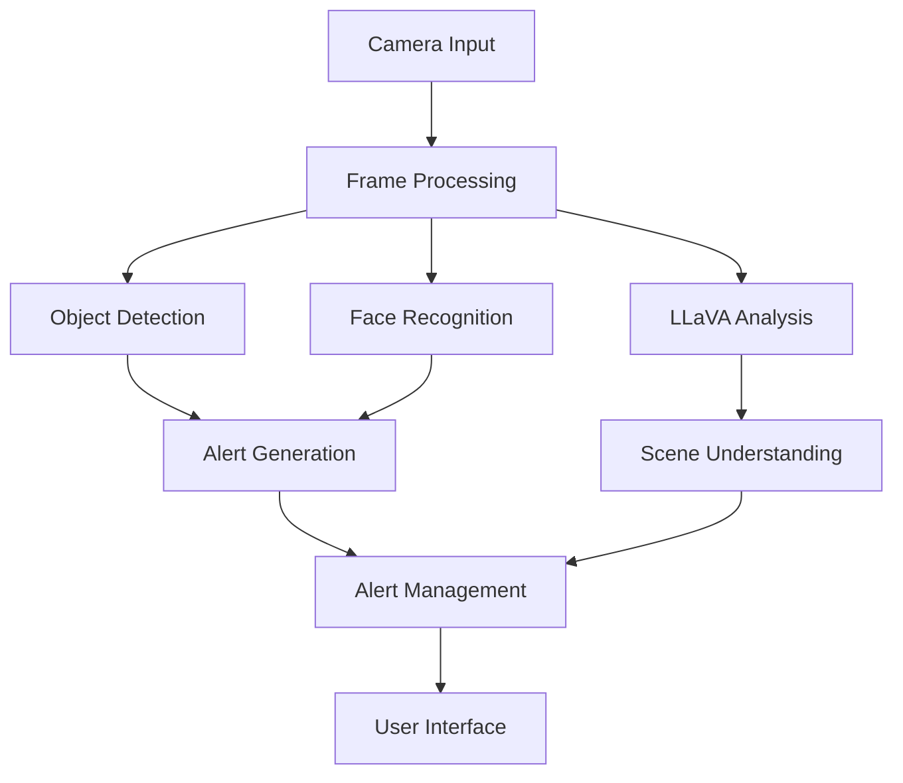

### Detailed Component Architecture
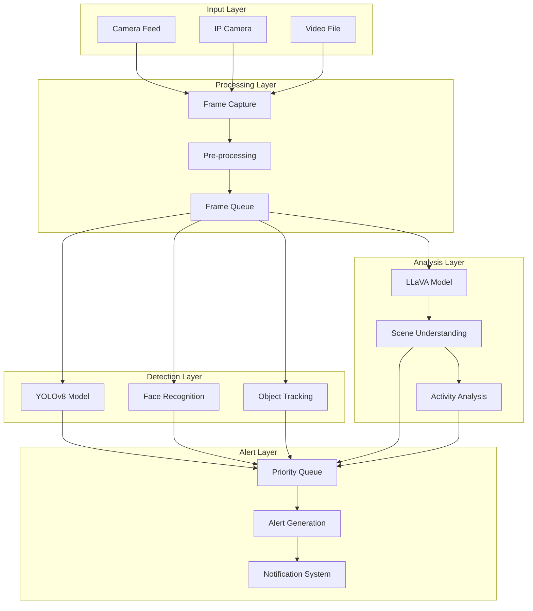

## Key Components

### 1. Object Detection (YOLOv8)
- Real-time object detection
- Multiple object categories
- Confidence-based filtering
- Priority-based alerting

### 2. Face Recognition
- Known face database
- Real-time face matching
- Person tracking
- Access control integration

### 3. LLaVA Integration
- Advanced scene understanding
- Natural language descriptions
- Security concern detection
- Activity analysis

## Performance Metrics

### Detection Accuracy Over Time


### Resource Utilization
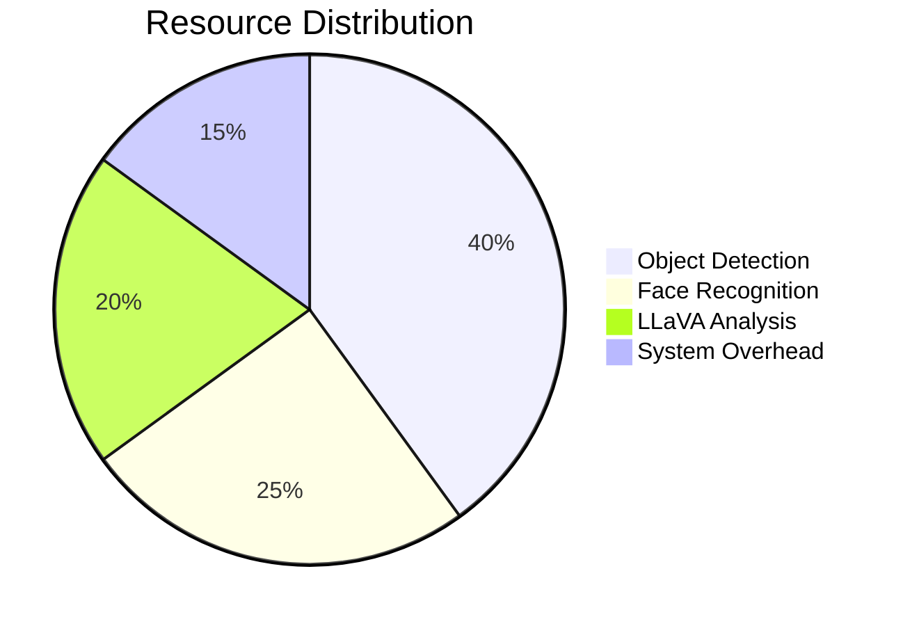

### Processing Pipeline Timing
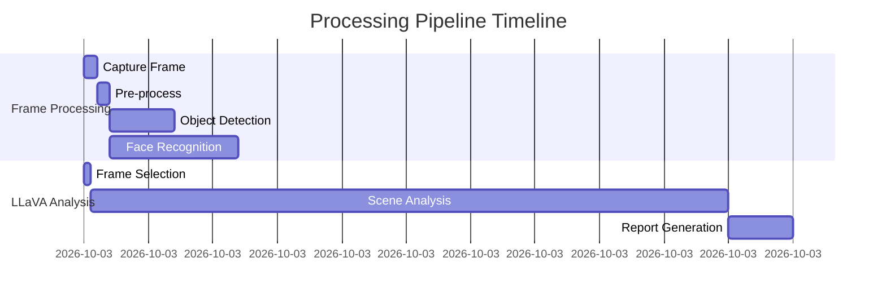

## LLaVA Integration Details

### LLaVA Processing Pipeline
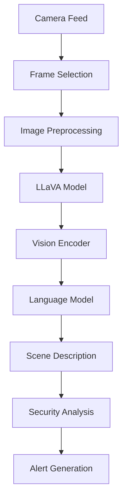

### LLaVA Model Architecture
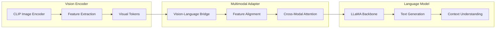

### LLaVA Analysis Workflow
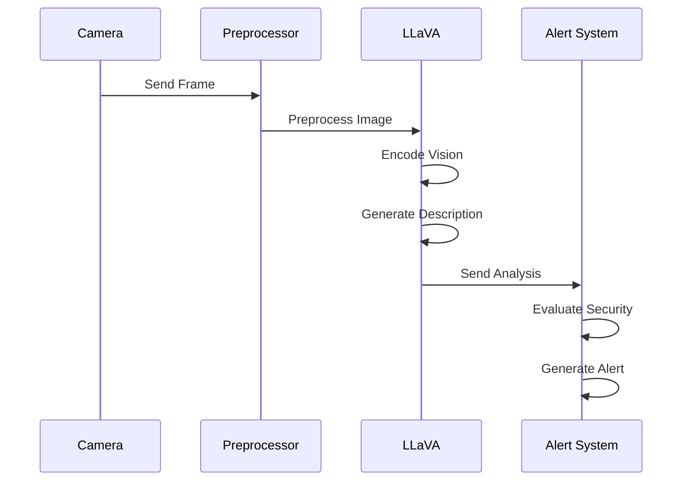

## Performance Analysis

### Frame Processing Speed
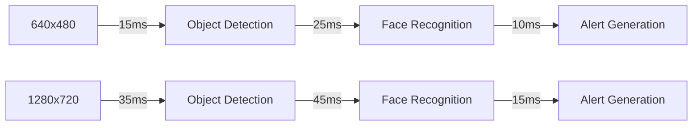

### Memory Usage Pattern
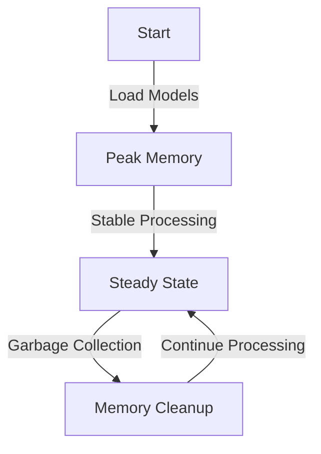

### GPU Utilization
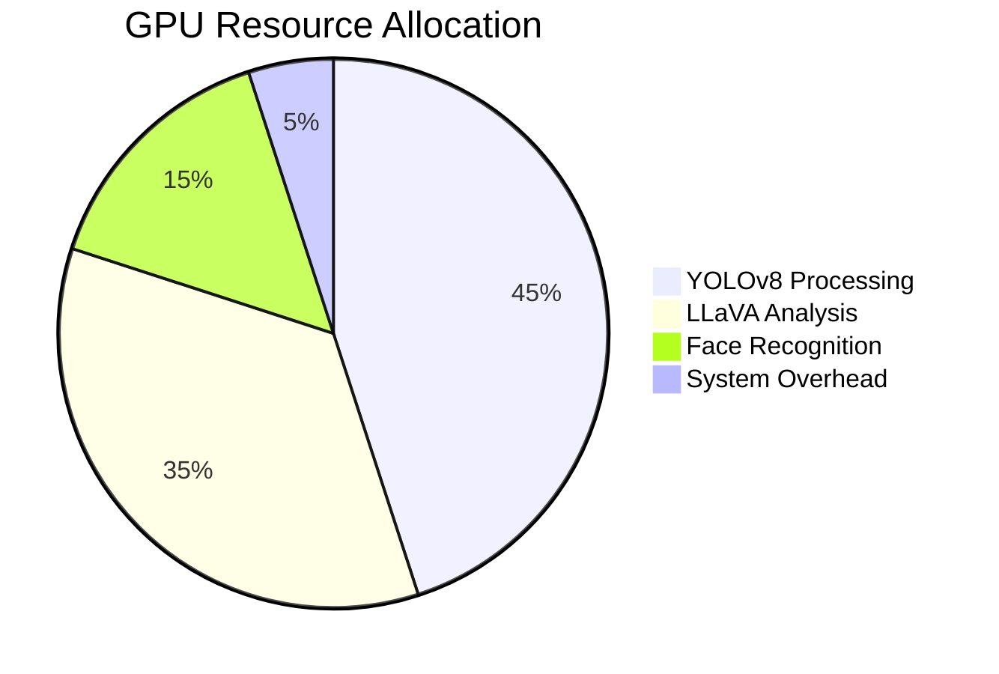

## Alert System Architecture

### Alert Processing Flow
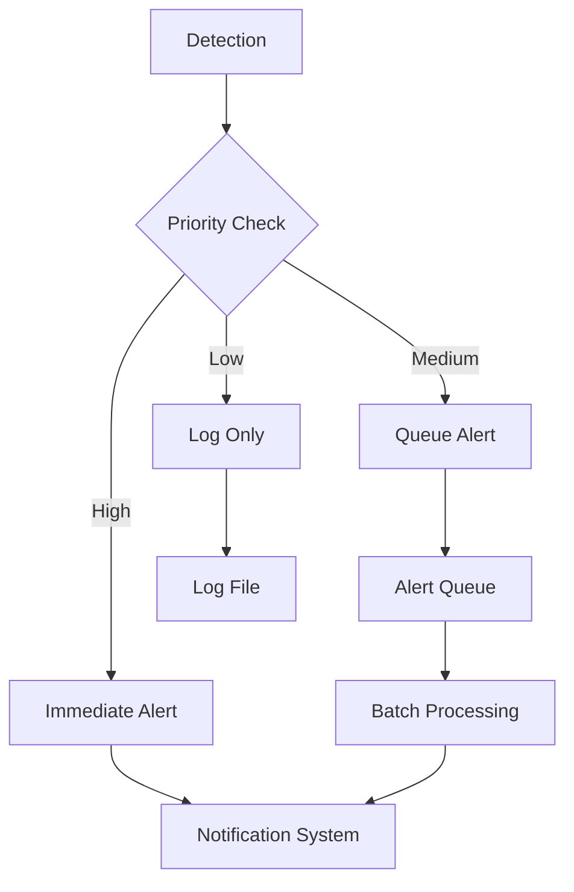

### Alert Distribution Heatmap
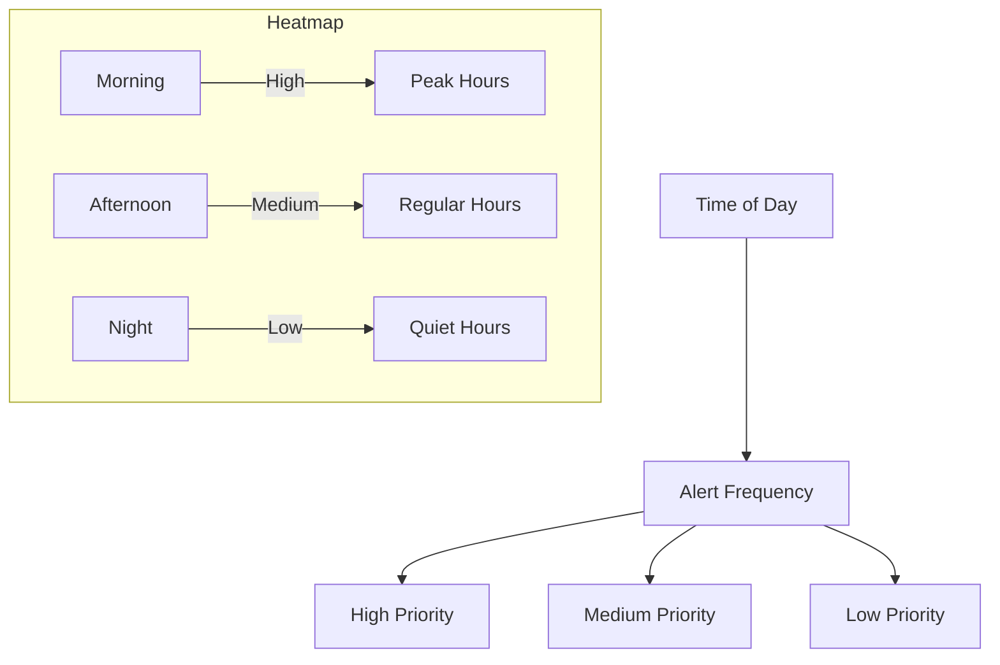

## Alert Categories

| Category | Objects | Priority | Response Time |
|----------|---------|----------|---------------|
| High | Person, Weapon, Phone | Immediate | < 2s |
| Medium | Vehicle, Animal | Moderate | < 5s |
| Low | Common Objects | Low | < 10s |

## System Requirements

### Hardware Requirements
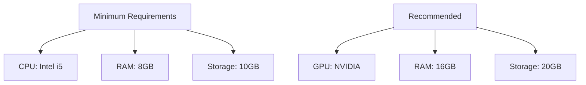

### Software Stack
- Python 3.8+
- CUDA Toolkit (for GPU acceleration)
- Required Python packages (see requirements.txt)

## Installation Guide

1. **Environment Setup**
   ```bash
   # Create virtual environment
   python -m venv venv
   source venv/bin/activate  # Linux/Mac
   venv\Scripts\activate     # Windows

   # Install dependencies
   pip install -r requirements.txt
   ```

2. **Model Download**
   ```bash
   # YOLOv8 model will be downloaded automatically
   # LLaVA model will be downloaded on first run
   ```

3. **Directory Structure**
   ```
   SmartSentry/
   ├── src/
   │   ├── config/
   │   ├── detectors/
   │   ├── alerts/
   │   └── main.py
   ├── data/
   │   ├── alerts/
   │   └── models/
   ├── known_faces/
   └── requirements.txt
   ```

## Usage Guide

### 1. Starting the System
```bash
python run.py
```

### 2. Keyboard Controls
| Key | Function |
|-----|----------|
| q | Quit application |
| p | Pause/Resume |
| s | Show summary |
| e | Export alerts |

### 3. Alert Management
- Real-time alert logging
- Periodic summaries
- CSV export functionality
- Alert categorization

## Advanced Features

### 1. LLaVA Integration
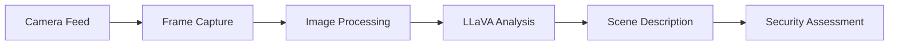

### 2. Performance Optimization
- Frame processing: 100ms interval
- LLaVA analysis: 30s interval
- GPU acceleration
- Memory management

## Data Analysis

### Alert Distribution
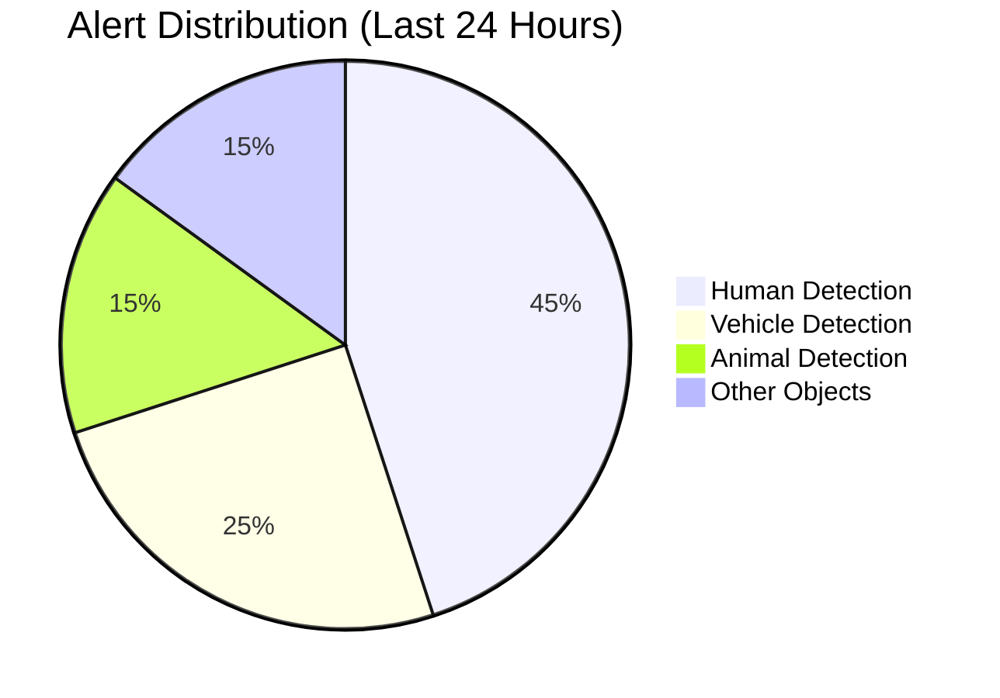

### Processing Time Analysis
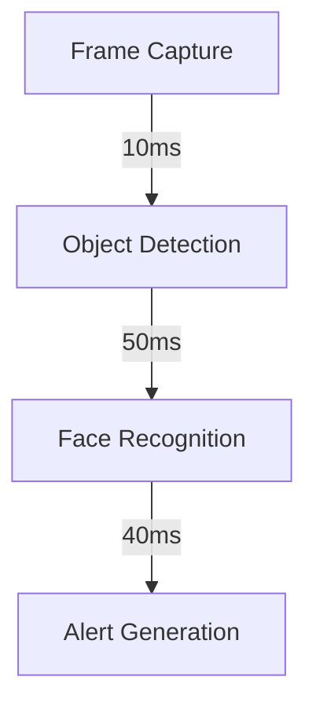

## Troubleshooting Guide

### Common Issues
1. **Camera Not Opening**
   - Check permissions
   - Verify camera index
   - Ensure no conflicts

2. **High Resource Usage**
   - Adjust frame size
   - Increase intervals
   - Use GPU acceleration

3. **Model Loading Issues**
   - Check GPU memory
   - Verify CUDA installation
   - Clear model cache

## Future Enhancements

1. **Planned Features**
   - Multi-camera support
   - Cloud integration
   - Mobile notifications
   - Advanced analytics

2. **Performance Improvements**
   - Optimized model loading
   - Reduced memory usage
   - Faster processing
   - Better accuracy

## Contributing

1. Fork the repository
2. Create feature branch
3. Commit changes
4. Push to branch
5. Create Pull Request

## License

This project is licensed under the MIT License - see the [LICENSE](LICENSE) file for details.

## Acknowledgments

- YOLOv8 team for object detection
- LLaVA team for vision-language model
- OpenCV community
- All contributors
=======
# Intelligent Security Camera System

A comprehensive security camera system that combines object detection, face recognition, and alert management to provide intelligent surveillance capabilities.

## Features

- Real-time object detection using YOLOv8
- Face recognition and tracking
- Priority-based alert system
- Detailed alert logging and reporting
- Memory-efficient processing
- Configurable detection thresholds
- Exportable alert data

## System Architecture

### Core Modules

1. **Main Application (`src/main.py`)**
   - Manages the video capture and processing pipeline
   - Coordinates between different detection modules
   - Handles user interface and keyboard controls
   - Implements memory management and garbage collection

2. **Object Detection (`src/detectors/object_detector.py`)**
   - Implements YOLOv8-based object detection
   - Categorizes objects by priority (High, Medium, Low)
   - Draws bounding boxes and labels
   - Handles detection confidence thresholds

3. **Face Detection (`src/detectors/face_detector.py`)**
   - Implements face detection and recognition
   - Maintains a database of known faces
   - Tracks recognized individuals
   - Integrates with object detection to filter person detections

4. **Alert Management (`src/alerts/alert_manager.py`)**
   - Manages alert logging and storage
   - Implements cooldown periods for alerts
   - Generates alert summaries
   - Exports alert data to CSV
   - Maintains alert history

5. **Configuration (`src/config/settings.py`)**
   - Centralized configuration management
   - Defines detection thresholds
   - Sets up file paths and directories
   - Configures time windows for alerts

## Setup Instructions

1. **Prerequisites**
   ```bash
   pip install -r requirements.txt
   ```

2. **Directory Structure**
   ```
   project/
   ├── src/
   │   ├── config/
   │   ├── detectors/
   │   ├── alerts/
   │   └── main.py
   ├── data/
   │   ├── alerts/
   │   └── models/
   ├── known_faces/
   └── requirements.txt
   ```

3. **Configuration**
   - Adjust settings in `src/config/settings.py`
   - Configure camera source and resolution
   - Set detection thresholds and intervals
   - Define object categories and priorities

## Usage

1. **Starting the Application**
   ```bash
   python -m src.main
   ```

2. **Keyboard Controls**
   - `q`: Quit application
   - `p`: Pause/Resume processing
   - `s`: Show alert summary
   - `e`: Export alerts to CSV

3. **Alert Management**
   - Alerts are automatically logged to `data/alerts/alerts.json`
   - Periodic summaries are displayed in the console
   - Export alerts to CSV for analysis

## Advanced Features

1. **Priority-based Detection**
   - High Priority: Persons, weapons, phones
   - Medium Priority: Valuable items
   - Low Priority: Common objects
   - Configurable thresholds and cooldowns

2. **Memory Management**
   - Automatic garbage collection
   - Optimized frame processing
   - Efficient alert storage

3. **Face Recognition Integration**
   - Known face filtering
   - Person tracking
   - Recognition confidence thresholds

## Performance Optimization

- Frame resizing for faster processing
- Periodic garbage collection
- Efficient alert storage and retrieval
- Configurable detection intervals
- Memory-efficient object tracking

## Troubleshooting

1. **Camera Not Opening**
   - Check camera permissions
   - Verify camera index in settings
   - Ensure no other application is using the camera

2. **High CPU/Memory Usage**
   - Adjust frame size in settings
   - Increase detection intervals
   - Reduce detection confidence thresholds

3. **Alert File Issues**
   - Check directory permissions
   - Verify file paths in settings
   - Ensure sufficient disk space

## Contributing

1. Fork the repository
2. Create a feature branch
3. Commit your changes
4. Push to the branch
5. Create a Pull Request

## License

This project is licensed under the MIT License - see the LICENSE file for details.
>>>>>>> cee311a2b267c73a779e91d70049da281757be32
